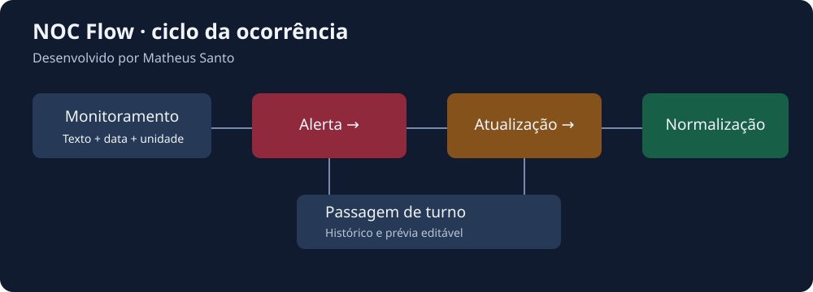

# NOC Flow

[](https://github.com/MSsanto/Noc_flow/actions/workflows/tests.yml)

**Desenvolvido por Matheus Santo**

Gerenciador de ocorrências de rede que transforma alertas de monitoramento em comunicados padronizados, acompanha atualizações e normalizações e prepara a passagem de turno. Esta edição de portfólio contém exclusivamente exemplos fictícios.

**[Abrir demonstração online](https://noc-flow-matheus-santo.handy-olm-1850.chatgpt.site)**



## Problema resolvido

Na rotina de um NOC, copiar informações entre monitoramento, planilhas e mensagens exige consultas repetidas e pode gerar omissões, duplicidade e divergência entre comunicados. O NOC Flow reúne consulta cadastral, preparação de mensagens e histórico local em uma interface.

O projeto demonstra automação de etapas manuais e validações concretas. Não afirma percentuais de produtividade ou horas economizadas sem medição.

## Executar

Baixe o projeto e abra `index.html` em um navegador moderno. Não exige instalação, API, banco de dados ou conexão externa para funcionar.

Para servir localmente com Python 3:

```bash
python3 -m http.server 8080
```

Abra `http://localhost:8080`. Use **Carregar demonstração** para criar um alerta, uma atualização, uma normalização e o histórico do turno com dados fictícios. Essa ação pede confirmação antes de substituir ocorrências locais desta aplicação.

## Recursos

- Parser de alertas e consolidação de WAN 1/WAN 2 próximas no tempo.
- Prevenção de duplicatas do mesmo site na janela de um minuto.
- Atualização e normalização por site, ITSM ou protocolo, inclusive registros de outro turno.
- Exclusão de alerta, pesquisa, ordenação e temas claro/escuro.
- Base de unidades com pesquisa e gerador de abertura para operadora.
- Importação local de base JSON/CSV/TSV, backup/restauração e exportação CSV.
- Passagem de turno com prévia editável; turnos de 06h–18h e 18h–06h.
- Métricas locais de ações, sem economia de tempo presumida.
- Cliente, contatos, unidades, operadoras, severidades e comunicados configuráveis.

## Configurar outra operação

Edite `config/operation.js`. A interface e o gerador usam essa configuração; não é necessário alterar o parser para trocar cadastros. Consulte [Configuração](docs/CONFIGURACAO.md).

Formato de entrada do monitoramento:

```text
04-09-2026 07:25:29 Monitoramento Unidade Aurora - SP_9000001 - WAN 1 com problemas!
04-09-2026 07:25:59 Monitoramento Unidade Aurora - SP_9000001 - WAN 2 com problemas!
```

Use a data atual ao testar relatórios do turno atual. Eventos antigos continuam associados às respectivas datas.

## Tecnologias e decisões

HTML, CSS e JavaScript sem framework ou dependências externas de execução. Persistência local com `localStorage`; Node.js para testes sem pacotes adicionais. [Decisões técnicas](docs/ARQUITETURA.md) e [validação](docs/VALIDACAO.md).

## Limitações

Os registros pertencem ao navegador e à origem em que a página foi aberta. Não há autenticação, sincronização entre analistas ou envio automático de mensagens. Use os backups para conservar o trabalho. A edição de demonstração não contém credenciais, integrações corporativas nem cadastros reais.

O layout foi preservado da ferramenta de origem. Nesta entrega os testes de integração usam um DOM simulado; não substituem validação visual em navegadores reais.

## Autoria e uso

**Desenvolvido por Matheus Santo**. Edição independente de portfólio, versão 1.0.0. Sem licença aberta concedida nesta entrega (`UNLICENSED`); visibilidade pública e licença de reutilização são decisões distintas.
