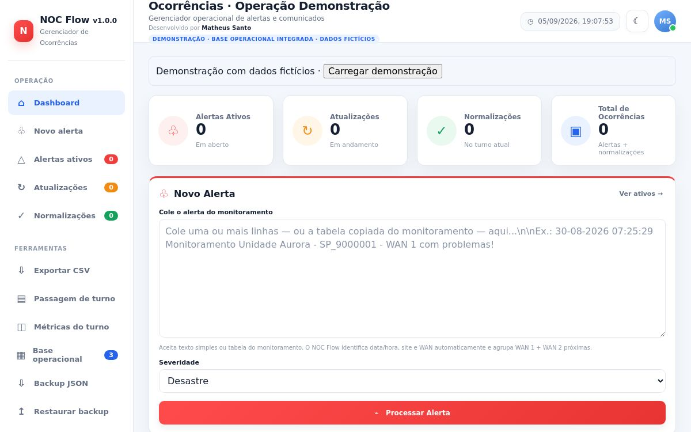

# NOC Flow

[](https://github.com/MSsanto/Noc_flow/actions/workflows/tests.yml)

**Versão atual:** v1.1.0  
**Desenvolvido por Matheus Santo**

Gerenciador configurável de ocorrências de rede que transforma alertas de monitoramento em comunicados padronizados, acompanha atualizações e normalizações e prepara a passagem de turno. Esta edição pública de portfólio usa exclusivamente exemplos fictícios e não depende de cadastros corporativos reais.

**[Abrir demonstração online](https://noc-flow-matheus-santo.matheus-sergio.chatgpt.site)**




## Problema resolvido

Na rotina de um NOC, copiar informações entre monitoramento, planilhas e mensagens exige consultas repetidas e pode gerar omissões, duplicidade e divergência entre comunicados. O NOC Flow reúne consulta cadastral, preparação de mensagens, acompanhamento de ocorrências e histórico local em uma interface.

O projeto demonstra automação de etapas manuais e validações concretas. Não afirma percentuais de produtividade ou horas economizadas sem medição.

## Novidades da v1.1.0

A v1.1.0 preserva o fluxo funcional da edição anterior e melhora a experiência do operador em notebook/desktop:

- sidebar reorganizada em **Operação**, **Apoio ao plantão**, **Dados** e **Sistema**;
- rolagem independente da sidebar e foco visual no destino dos atalhos;
- plantão atual destacado no topo;
- cabeçalho mais compacto;
- cards de Alertas, Atualizações e Normalizações como atalhos;
- busca com escopo explícito por aba e ordenação selecionada visível;
- feedback visual de vínculo com ocorrência ativa;
- feedbacks rotineiros por toast, mantendo confirmações para ações de risco;
- **Reiniciar plantão** com backup automático e preservação da Base Operacional e tema;
- **Próximos Passos** contextuais conforme a Situação Atual, configuráveis em `config/operation.js`;
- opção adicional de normalização **Energia elétrica restabelecida na localidade**.

As melhorias são genéricas e configuráveis. Nenhuma regra depende de identidade, cadastro ou fluxo de um cliente específico.

## Executar

Baixe o projeto e abra `index.html` em um navegador moderno. Não exige API, banco de dados ou conexão externa para funcionar.

Para servir localmente com Python 3:

```bash
python3 -m http.server 8080
```

Abra `http://localhost:8080`. Use **Carregar demonstração** para criar um alerta, uma atualização, uma normalização e o histórico do turno com dados fictícios. Essa ação pede confirmação antes de substituir ocorrências locais desta aplicação.

## Recursos

- Parser de alertas e consolidação de WAN 1/WAN 2 próximas no tempo.
- Prevenção de duplicatas do mesmo site na janela de um minuto.
- Atualização e normalização por site, ITSM ou protocolo, inclusive registros de outro turno.
- Exclusão de alerta, pesquisa, ordenação e temas claro/escuro.
- Base de unidades com pesquisa e gerador de abertura para operadora.
- Importação local de base JSON/CSV/TSV, backup/restauração e exportação CSV.
- Passagem de turno com prévia editável; turnos de 06h–18h e 18h–06h.
- Métricas locais de ações, sem economia de tempo presumida.
- Cliente, contatos, unidades, operadoras, severidades, comunicados e orientações de fluxo configuráveis.

## Configurar outra operação

Edite `config/operation.js`. A interface, os modelos, os dados demonstrativos e as orientações de próximos passos usam essa configuração. Consulte [Configuração](docs/CONFIGURACAO.md).

Formato de entrada do monitoramento:

```text
04-09-2026 07:25:29 Monitoramento Unidade Aurora - SP_9000001 - WAN 1 com problemas!
04-09-2026 07:25:59 Monitoramento Unidade Aurora - SP_9000001 - WAN 2 com problemas!
```

Use a data atual ao testar relatórios do turno atual. Eventos antigos continuam associados às respectivas datas.

## Tecnologias e decisões

HTML, CSS e JavaScript sem framework ou dependências externas de execução. Persistência local com `localStorage`; Node.js para testes sem pacotes adicionais.

A lógica principal continua modularizada em `parser.js`, `shift.js`, `app.js` e `operational-base.js`. A v1.1.0 adiciona uma camada isolada `ux-v1.1.js`/`ux-v1.1.css`, permitindo evoluir ergonomia sem reescrever o núcleo funcional.

Consulte [Decisões técnicas](docs/ARQUITETURA.md), [configuração](docs/CONFIGURACAO.md), [UX v1.1](docs/UX_V1_1.md), [publicação segura](docs/PUBLICACAO_SEGURA.md) e [validação](docs/VALIDACAO.md).

## Segurança da edição pública

O repositório contém somente dados fictícios de demonstração. A configuração padrão usa três unidades inventadas, IDs `DEMO-*`, operadoras explicitamente fictícias e nenhum telefone, endereço, CNPJ, circuito ou contato corporativo real.

Não publique neste repositório bases exportadas de operações, backups locais, credenciais, tokens, contatos internos ou identificadores de clientes. Consulte `docs/PUBLICACAO_SEGURA.md` antes de adicionar novos exemplos.

## Limitações

Os registros pertencem ao navegador e à origem em que a página foi aberta. Não há autenticação, sincronização entre analistas ou envio automático de mensagens. Use os backups para conservar o trabalho. A edição de demonstração não contém integrações corporativas nem cadastros reais.

Os testes automatizados usam um DOM simulado e validações de configuração; não substituem validação visual em navegadores reais.

## Autoria e uso

**Desenvolvido por Matheus Santo**. Edição independente de portfólio, versão 1.1.0. Sem licença aberta concedida nesta entrega (`UNLICENSED`); visibilidade pública e licença de reutilização são decisões distintas.
